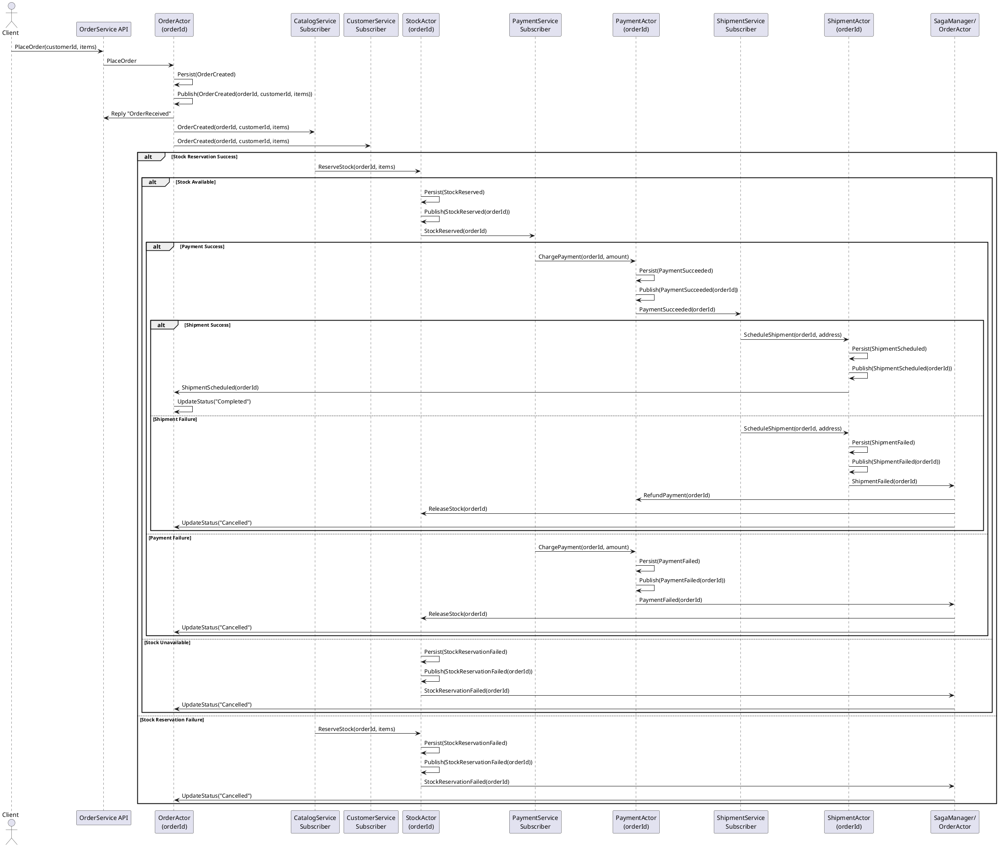

# Actor-Based Order System Design

## Overview

Build an e-commerce “Order System” comprising multiple microservices (Catalog, Customer, Order, Shipment, Payment, etc.), each owning its own bounded data context. Leverage the actor model to:

Avoid distributed transactions and locks by confining state changes to single-threaded actors.

Preserve data ownership and autonomy of each service.

Coordinate cross-context workflows via asynchronous messaging (Saga pattern).

Deploy in a scalable, decoupled fashion: each service runs its own actor system (container or process), hosting many actor instances.

## High Level Architecture

```text
      ┌───────────────────────────┐         ┌───────────────────────────┐
      │   CatalogService          │         │   CustomerService         │
      │   (Actor System A)        │         │   (Actor System B)        │
      │   ┌───────────────────┐   │         │   ┌───────────────────┐   │
      │   │ ProductActor(…)   │   │         │   │ CustomerActor(…)  │   │
      │   │ ProductActor(…)   │   │         │   │ CustomerActor(…)  │   │
      │   └───────────────────┘   │         │   └───────────────────┘   │
      └───────────────────────────┘         └───────────────────────────┘
                ▲     ▲                                 ▲     ▲
                │     │  Event / Command Messages       │     │
                │     │                                 │     │
                │     │                                 │     │
                ▼     ▼                                 ▼     ▼
      ┌───────────────────────────┐         ┌───────────────────────────┐
      │   OrderService            │         │   PaymentService         │
      │   (Actor System C)        │         │   (Actor System D)       │
      │   ┌───────────────────┐   │         │   ┌───────────────────┐   │
      │   │ OrderActor(…)     │   │         │   │ PaymentActor(…)   │   │
      │   │ OrderActor(…)     │   │         │   │ PaymentActor(…)   │   │
      │   └───────────────────┘   │         │   └───────────────────┘   │
      └───────────────────────────┘         └───────────────────────────┘
                ▲     ▲                                 ▲
                │     │                                 │
                │     │                                 │
                ▼     ▼                                 ▼
      ┌───────────────────────────┐         ┌───────────────────────────┐
      │   ShipmentService         │         │   … (Other Services)      │
      │   (Actor System E)        │         │                           │
      │   ┌───────────────────┐   │         │                           │
      │   │ ShipmentActor(…)  │   │         │                           │
      │   │ ShipmentActor(…)  │   │         │                           │
      │   └───────────────────┘   │         │                           │
      └───────────────────────────┘         └───────────────────────────┘

```
- Each bounded context (Catalog, Customer, Order, Payment, Shipment, etc.) is hosted in its own Actor System (a single process or container).
- Within each system, each aggregate instance (e.g., a specific Product, Customer, Order, Payment, Shipment) is represented by a dedicated long-lived actor.
- All actors process messages sequentially (single-threaded), eliminating intra-aggregate locks.
- Cross-context workflows (e.g. “place order → reserve stock → charge payment → schedule shipment”) are orchestrated via asynchronous event messaging (Saga pattern).

## Core Principles

- **No Distributed Transactions**: Instead of 2PC or saga patterns, we use eventual consistency through actor messaging
- **Single-Threaded Actors**: Each actor processes one message at a time, eliminating the need for locks
- **Message-Driven**: All communication happens through immutable messages
- **Event Sourcing**: Actors maintain state through event streams for recovery and audit

## Actor Model Mapping

### One Actor System per Bounded Context

- CatalogService → hosts ProductActor[productId] for each product.
- CustomerService → hosts CustomerActor[customerId].
- OrderService → hosts OrderActor[orderId].
- PaymentService → hosts PaymentActor[paymentId].
- ShipmentService → hosts ShipmentActor[shipmentId].
- (And similarly for any additional contexts.)

Each actor system is a lightweight, in-memory runtime (e.g. Akka.NET, Orleans, Service Fabric Actors) that:

- Keeps actor state private and entirely owned by that actor.
- Ensures serial execution of messages for each actor, avoiding shared-state locks.
- Provides persistence capabilities (event sourcing or local database) for crash recovery and state durability.

### One Actor per Aggregate Instance

- Aggregate = a consistency boundary (e.g. a single Order).
- Each actor instance encapsulates its aggregate’s entire state and invariants.
- Example: `OrderActor("ORD-1001")` receives commands (`PlaceOrder`, `CancelOrder`, etc.), updates its own state, and emits domain events (`OrderCreated`, `OrderCancelled`, …).

Actors never share state or locks. All operations on an aggregate are handled by its dedicated actor, which processes commands one at a time.

## Cross-Context Coordination via Sagas

### Saga Pattern (Choreography)

1. OrderActor persists OrderCreated(orderId, customerId, items…) → publishes OrderCreated event onto a message bus (Kafka, RabbitMQ, or Akka event stream).
2. CatalogActor (in CatalogService) subscribes to OrderCreated; upon receipt, issues ReserveStock(orderId, items…) to its own StockActor (or directly ProductActors).
    - If stock is available → persists internal state, then publishes StockReserved(orderId).
    - If not → publishes StockReservationFailed(orderId, reason).
3. PaymentActor (in PaymentService) subscribes to StockReserved; attempts ChargePayment(orderId, amount…).
    - On success → publishes PaymentSucceeded(orderId).
    - On failure → publishes PaymentFailed(orderId, reason).
4. ShipmentActor (in ShipmentService) subscribes to PaymentSucceeded; does ScheduleShipment(orderId, address…).
    - Publishes ShipmentScheduled(orderId, tracking…) on success.
    - On failure → publishes ShipmentFailed(orderId).
5. OrderActor subscribes to all related events (StockReserved, PaymentSucceeded, ShipmentScheduled, and any *Failed). It transitions its own state accordingly (e.g. from “Created” → “Stock Reserved” → “Payment Done” → “Shipped,” or “Cancelled” on any failure).
6. Compensation: If PaymentFailed, a compensating event ReleaseStock(orderId) is emitted; CatalogActor listens to ReleaseStock to undo reservation. Similarly, if ShipmentFailed, a compensation might be RefundPayment(orderId).

#### Characters:

- No distributed transaction or two-phase commit.
- Each context only does local commits; subsequent steps are triggered by events.
- Each actor is responsible for idempotency (e.g. if ReserveStock(orderId) is received twice, it only reserves once).

### Saga Pattern (Orchestration)

Optionally, a dedicated SagaManagerActor (hosted in OrderService or a separate “Orchestrator” Service) can explicitly send commands in sequence:

1. Send `ReserveStock` to CatalogActor; await reply.
2. If success → send `ChargePayment` to PaymentActor; await reply.
3. If success → send `ScheduleShipment` to ShipmentActor; await reply.
4. If any step fails → send compensations (`ReleaseStock`, `RefundPayment`, etc.) to relevant actors.

The difference is that orchestration centralizes flow control in one actor. However, both patterns avoid distributed locks/transactions by relying on message-driven, asynchronous coordination.

## Actor Persistence & Idempotency

1. Event Sourcing or Local Transaction
    - Each actor persists commands as immutable events (to an event store or local database) before sending outgoing messages.
    - If persistence fails, actor retries.
    - Only after local persist succeeds does the actor publish a domain event.
2. Idempotent Message Handling
    - Each actor records “last processed event/command ID.” If it receives the same command twice (due to retries), it ignores the duplicate.
    - E.g., if `ReserveStock(orderId)` arrives again, `CatalogActor` ignores the duplicate checks if it already reserved for that order; if so, it replies success without double-reserving.
3. Local Transactions
    - E.g., `OrderActor` may update its own relational database row or append to an event table. This is a single ACID transaction in one database—no multi-service transaction.

## Deployment Topology & Scaling

### One Container/Process per Bounded Context

- CatalogService Container: runs an Akka.NET (or Orleans) actor system. Hosts many ProductActor instances.
- CustomerService Container: hosts many CustomerActor instances.
- OrderService Container: hosts many OrderActor instances (also the SagaManagerActor if using orchestration).
- PaymentService Container: hosts many PaymentActor instances.
- ShipmentService Container: hosts many ShipmentActor instances.

Each container can be replicated (e.g., 2–3 replicas behind a load balancer) for high availability. Use cluster sharding (Akka.Cluster.Sharding) or Orleans’ built-in placement so that each aggregate’s actor lives on exactly one replica at a time. This preserves single-threaded processing per actor and automatically rebalances on node failure.

### Service Discovery & Messaging

- Message Bus: Kafka, RabbitMQ, or Akka.Cluster Event Bus—used for event publication/subscription. Subscribe to only the event types each service cares about.
- API Gateways: Each service exposes a lightweight HTTP/gRPC façade for external clients (e.g. web UI, mobile). The façade forwards commands (PlaceOrder, GetOrderStatus, etc.) to the appropriate actor (via local actor selection or sharding) and returns a Future/Promise or immediate acknowledgment.

### Fault Tolerance & Self-Healing

- If any actor system replica crashes, cluster membership triggers automatic failover:
  - Cluster Sharding will re-spawn actor instances for only those shards that were on the failed node onto remaining healthy nodes.
  - Stateful actors recover state from their event store on startup.
- Outgoing saga messages (to other contexts) are retried until success.

## Summary of Key Properties

1. No distributed locks or two-phase commits: All data modifications are local to one actor. Cross-context consistency is handled by asynchronous events and compensations.
2. Actors enforce single-threaded execution per aggregate: No risk of concurrent modification inside an actor.
3. Each service owns its own data store: No cross-service tables or foreign keys.
4. Asynchronous messaging (Saga) ensures eventual consistency across contexts.
5. Cluster Sharding & Replication allow horizontal scaling and fault tolerance without sacrificing actor semantics.
6. Deployment: each bounded context is a standalone container or process hosting an actor system. Multiple replicas per service can run behind a load balancer or service mesh.



### Service Actors

#### 1. Order Service Actor
**Responsibilities:**
- Creates and manages individual order actors
- Routes messages to appropriate order instances
- Maintains order lifecycle state machine

**Messages:**
- `CreateOrder(customerId, items, shippingAddress)`
- `OrderCreated(orderId, customerId, items, totalAmount)`
- `UpdateOrderStatus(orderId, status)`
- `CancelOrder(orderId, reason)`

**State Transitions:**
```
Pending → PaymentProcessing → PaymentConfirmed → Preparing → Shipped → Delivered
     ↓            ↓                    ↓              ↓          ↓
  Cancelled    PaymentFailed      OutOfStock    ShipmentFailed  ReturnRequested
```

#### 2. Payment Service Actor
**Responsibilities:**
- Processes payment requests
- Manages payment state and retries
- Communicates with external payment gateways

**Messages:**
- `ProcessPayment(orderId, accountId, amount, paymentMethod)`
- `PaymentSucceeded(paymentId, orderId, transactionId)`
- `PaymentFailed(paymentId, orderId, reason)`
- `RefundPayment(paymentId, amount)`

#### 3. Account Service Actor
**Responsibilities:**
- Manages customer account balances
- Tracks transaction history
- Validates account status

**Messages:**
- `ValidateAccount(accountId)`
- `DebitAccount(accountId, amount, orderId)`
- `CreditAccount(accountId, amount, reason)`
- `AccountDebited(accountId, newBalance)`
- `InsufficientFunds(accountId, requestedAmount)`

#### 4. Catalog Service Actor
**Responsibilities:**
- Manages product inventory
- Reserves items for orders
- Handles stock updates

**Messages:**
- `CheckAvailability(productId, quantity)`
- `ReserveItems(orderId, items)`
- `ReleaseReservation(orderId, items)`
- `UpdateStock(productId, quantity)`
- `ItemsReserved(orderId, reservationId)`
- `ItemsUnavailable(productId, requestedQty, availableQty)`

#### 5. Shipment Service Actor
**Responsibilities:**
- Creates shipping labels
- Tracks shipment status
- Coordinates with carriers

**Messages:**
- `CreateShipment(orderId, items, address)`
- `UpdateShipmentStatus(shipmentId, status, location)`
- `ShipmentCreated(shipmentId, orderId, trackingNumber)`
- `ShipmentDelivered(shipmentId, orderId, deliveryTime)`

## Order Flow Sequence

### Happy Path
```
1. Customer → OrderService: CreateOrder
2. OrderService → OrderActor: Create new actor
3. OrderActor → CatalogService: CheckAvailability
4. CatalogService → OrderActor: ItemsAvailable
5. OrderActor → CatalogService: ReserveItems
6. CatalogService → OrderActor: ItemsReserved
7. OrderActor → AccountService: ValidateAccount
8. AccountService → OrderActor: AccountValid
9. OrderActor → PaymentService: ProcessPayment
10. PaymentService → AccountService: DebitAccount
11. AccountService → PaymentService: AccountDebited
12. PaymentService → OrderActor: PaymentSucceeded
13. OrderActor → ShipmentService: CreateShipment
14. ShipmentService → OrderActor: ShipmentCreated
15. OrderActor → Customer: OrderConfirmed
```

### Compensation Flow (Payment Failure)
```
1. PaymentService → OrderActor: PaymentFailed
2. OrderActor → CatalogService: ReleaseReservation
3. CatalogService → OrderActor: ReservationReleased
4. OrderActor → Customer: OrderCancelled(PaymentFailed)
```

## State Management

### Actor State Persistence
Each actor maintains its state using Akka.Persistence:

```csharp
public class OrderActor : ReceivePersistentActor
{
    private OrderState _state = new OrderState();

    public override string PersistenceId => $"order-{_orderId}";

    private void UpdateState(IOrderEvent evt)
    {
        _state = _state.Apply(evt);
    }
}
```

### Event Types
```csharp
public interface IOrderEvent { }

public record OrderCreatedEvent(
    string OrderId,
    string CustomerId,
    List<OrderItem> Items,
    decimal TotalAmount,
    DateTime CreatedAt
) : IOrderEvent;

public record PaymentProcessedEvent(
    string OrderId,
    string PaymentId,
    PaymentStatus Status
) : IOrderEvent;

public record ItemsReservedEvent(
    string OrderId,
    string ReservationId,
    List<OrderItem> Items
) : IOrderEvent;
```

## Consistency Guarantees

### Eventual Consistency
- Each service maintains its own consistent state
- Cross-service consistency achieved through messaging
- Compensating actions handle failure scenarios

### Idempotency
All message handlers must be idempotent:
```csharp
public void Handle(ProcessPayment msg)
{
    if (_processedPayments.Contains(msg.PaymentId))
    {
        Sender.Tell(new PaymentAlreadyProcessed(msg.PaymentId));
        return;
    }
    // Process payment...
}
```

### Timeout Handling
```csharp
Context.SetReceiveTimeout(TimeSpan.FromSeconds(30));
Receive<ReceiveTimeout>(_ =>
{
    // Trigger compensation or retry logic
    Self.Tell(new CheckOrderStatus(_orderId));
});
```

## Failure Handling

### Actor Supervision
```csharp
public class ServiceSupervisor : ReceiveActor
{
    protected override SupervisorStrategy SupervisorStrategy()
    {
        return new OneForOneStrategy(
            maxNrOfRetries: 3,
            withinTimeRange: TimeSpan.FromMinutes(1),
            localOnlyDecider: ex => ex switch
            {
                TransientException => Directive.Restart,
                PersistenceException => Directive.Stop,
                _ => Directive.Escalate
            });
    }
}
```

### Retry Strategies
- Exponential backoff for external service calls
- Circuit breaker pattern for payment gateway
- Dead letter queue for unprocessable messages

## Monitoring and Observability

### Actor Metrics
- Message processing time
- Queue depth per actor
- Failure rates
- State transition counts

### Distributed Tracing
- Correlation IDs flow through all messages
- OpenTelemetry integration for trace visualization

### Event Log
All state changes persisted as events provide complete audit trail:
```
OrderCreated → ItemsReserved → PaymentProcessed → ShipmentCreated → OrderDelivered
```

## Implementation Guidelines

### Message Design
```csharp
public record CreateOrder(
    string CustomerId,
    List<OrderItem> Items,
    Address ShippingAddress,
    string CorrelationId = null
) : ICommand
{
    public string CorrelationId { get; init; } = CorrelationId ?? Guid.NewGuid().ToString();
}
```

### Actor Creation
```csharp
var orderActor = Context.ActorOf(
    Props.Create(() => new OrderActor(orderId)),
    name: $"order-{orderId}"
);
```

### Testing Strategy
- Unit tests for individual actor behavior
- Integration tests using Akka.TestKit
- Chaos testing for failure scenarios
