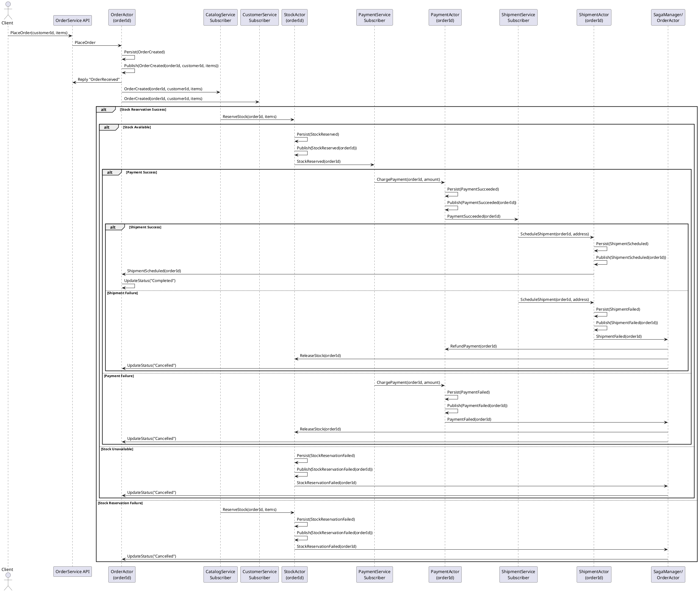

# Actor-Based Order System Design

## Overview

Build an e-commerce “Order System” comprising multiple microservices (Catalog, Customer, Order, Shipment, Payment, etc.), each owning its own bounded data context. Leverage the actor model to:

Avoid distributed transactions and locks by confining state changes to single-threaded actors.

Preserve data ownership and autonomy of each service.

Coordinate cross-context workflows via asynchronous messaging (Saga pattern).

Deploy in a scalable, decoupled fashion: each service runs its own actor system (container or process), hosting many actor instances.

## High Level Architecture

```text
      ┌───────────────────────────┐         ┌───────────────────────────┐
      │   CatalogService          │         │   CustomerService         │
      │   (Actor System A)        │         │   (Actor System B)        │
      │   ┌───────────────────┐   │         │   ┌───────────────────┐   │
      │   │ ProductActor(…)   │   │         │   │ CustomerActor(…)  │   │
      │   │ ProductActor(…)   │   │         │   │ CustomerActor(…)  │   │
      │   └───────────────────┘   │         │   └───────────────────┘   │
      └───────────────────────────┘         └───────────────────────────┘
                ▲     ▲                                 ▲     ▲
                │     │  Event / Command Messages       │     │
                │     │                                 │     │
                │     │                                 │     │
                ▼     ▼                                 ▼     ▼
      ┌───────────────────────────┐         ┌───────────────────────────┐
      │   OrderService            │         │   PaymentService         │
      │   (Actor System C)        │         │   (Actor System D)       │
      │   ┌───────────────────┐   │         │   ┌───────────────────┐   │
      │   │ OrderActor(…)     │   │         │   │ PaymentActor(…)   │   │
      │   │ OrderActor(…)     │   │         │   │ PaymentActor(…)   │   │
      │   └───────────────────┘   │         │   └───────────────────┘   │
      └───────────────────────────┘         └───────────────────────────┘
                ▲     ▲                                 ▲
                │     │                                 │
                │     │                                 │
                ▼     ▼                                 ▼
      ┌───────────────────────────┐         ┌───────────────────────────┐
      │   ShipmentService         │         │   … (Other Services)      │
      │   (Actor System E)        │         │                           │
      │   ┌───────────────────┐   │         │                           │
      │   │ ShipmentActor(…)  │   │         │                           │
      │   │ ShipmentActor(…)  │   │         │                           │
      │   └───────────────────┘   │         │                           │
      └───────────────────────────┘         └───────────────────────────┘

```
- Each bounded context (Catalog, Customer, Order, Payment, Shipment, etc.) is hosted in its own Actor System (a single process or container).
- Within each system, each aggregate instance (e.g., a specific Product, Customer, Order, Payment, Shipment) is represented by a dedicated long-lived actor.
- All actors process messages sequentially (single-threaded), eliminating intra-aggregate locks.
- Cross-context workflows (e.g. “place order → reserve stock → charge payment → schedule shipment”) are orchestrated via asynchronous event messaging (Saga pattern).

## Core Principles

- **No Distributed Transactions**: Instead of 2PC or saga patterns, we use eventual consistency through actor messaging
- **Single-Threaded Actors**: Each actor processes one message at a time, eliminating the need for locks
- **Message-Driven**: All communication happens through immutable messages
- **Event Sourcing**: Actors maintain state through event streams for recovery and audit

## Actor Model Mapping

### One Actor System per Bounded Context

- CatalogService → hosts ProductActor[productId] for each product.
- CustomerService → hosts CustomerActor[customerId].
- OrderService → hosts OrderActor[orderId].
- PaymentService → hosts PaymentActor[paymentId].
- ShipmentService → hosts ShipmentActor[shipmentId].
- (And similarly for any additional contexts.)

Each actor system is a lightweight, in-memory runtime (e.g. Akka.NET, Orleans, Service Fabric Actors) that:

- Keeps actor state private and entirely owned by that actor.
- Ensures serial execution of messages for each actor, avoiding shared-state locks.
- Provides persistence capabilities (event sourcing or local database) for crash recovery and state durability.

### One Actor per Aggregate Instance

- Aggregate = a consistency boundary (e.g. a single Order).
- Each actor instance encapsulates its aggregate’s entire state and invariants.
- Example: `OrderActor("ORD-1001")` receives commands (`PlaceOrder`, `CancelOrder`, etc.), updates its own state, and emits domain events (`OrderCreated`, `OrderCancelled`, …).

Actors never share state or locks. All operations on an aggregate are handled by its dedicated actor, which processes commands one at a time.

## Cross-Context Coordination via Choreography

### Saga Pattern (Choreography with Automatonymous State Machines)

The system uses **choreography pattern** where each service subscribes to relevant domain events and manages its own state transitions using **Automatonymous** state machines. This eliminates the need for a central orchestrator.

1. OrderActor persists OrderCreated(orderId, customerId, items…) → publishes OrderCreated event onto a message bus (Kafka, RabbitMQ, or Akka event stream).
2. CatalogActor (in CatalogService) subscribes to OrderCreated; upon receipt, issues ReserveStock(orderId, items…) to its own StockActor (or directly ProductActors).
    - If stock is available → persists internal state, then publishes StockReserved(orderId).
    - If not → publishes StockReservationFailed(orderId, reason).
3. PaymentActor (in PaymentService) subscribes to StockReserved; attempts ChargePayment(orderId, amount…).
    - On success → publishes PaymentSucceeded(orderId).
    - On failure → publishes PaymentFailed(orderId, reason).
4. ShipmentActor (in ShipmentService) subscribes to PaymentSucceeded; does ScheduleShipment(orderId, address…).
    - Publishes ShipmentScheduled(orderId, tracking…) on success.
    - On failure → publishes ShipmentFailed(orderId).
5. OrderActor subscribes to all related events (StockReserved, PaymentSucceeded, ShipmentScheduled, and any *Failed). It transitions its own state accordingly (e.g. from “Created” → “Stock Reserved” → “Payment Done” → “Shipped,” or “Cancelled” on any failure).
6. Compensation: If PaymentFailed, a compensating event ReleaseStock(orderId) is emitted; CatalogActor listens to ReleaseStock to undo reservation. Similarly, if ShipmentFailed, a compensation might be RefundPayment(orderId).

#### Characters:

- No distributed transaction or two-phase commit.
- Each context only does local commits; subsequent steps are triggered by events.
- Each actor is responsible for idempotency (e.g. if ReserveStock(orderId) is received twice, it only reserves once).

#### Order Flow with Automatonymous State Machine:

**OrderActor** uses Automatonymous state machine to manage order lifecycle:
```
Created → AwaitingStockReservation → StockReserved → PaymentCompleted → Shipped → Delivered
```

**State Machine Benefits**:
- **Type-safe transitions**: Automatonymous ensures only valid state changes
- **Automatic compensation**: State machine triggers compensation on failures  
- **Event correlation**: Each event maps to specific state transitions
- **Audit trail**: All state changes are persisted and recoverable

**Implementation Example**:
```csharp
public class OrderStateMachine : AutomatonymousStateMachine<OrderSagaData>
{
    public OrderStateMachine()
    {
        InstanceState(x => x.CurrentState);

        Initially(
            When(OrderCreatedEvent)
                .TransitionTo(AwaitingStockReservation)
                .ThenAsync(context => context.Instance.RequestStockReservations(context))
        );

        During(AwaitingStockReservation,
            When(AllStockReservedEvent)
                .TransitionTo(StockReserved)
                .ThenAsync(context => context.Instance.RequestPaymentProcessing(context)),
            When(StockReservationFailedEvent)
                .TransitionTo(Failed)
                .ThenAsync(context => context.Instance.HandleFailureCompensation(context))
        );
    }
}
```

### Saga Pattern (Orchestration)

Optionally, a dedicated SagaManagerActor (hosted in OrderService or a separate “Orchestrator” Service) can explicitly send commands in sequence:

1. Send `ReserveStock` to CatalogActor; await reply.
2. If success → send `ChargePayment` to PaymentActor; await reply.
3. If success → send `ScheduleShipment` to ShipmentActor; await reply.
4. If any step fails → send compensations (`ReleaseStock`, `RefundPayment`, etc.) to relevant actors.

The difference is that orchestration centralizes flow control in one actor. However, both patterns avoid distributed locks/transactions by relying on message-driven, asynchronous coordination.

## Actor Persistence & Idempotency

1. Event Sourcing or Local Transaction
    - Each actor persists commands as immutable events (to an event store or local database) before sending outgoing messages.
    - If persistence fails, actor retries.
    - Only after local persist succeeds does the actor publish a domain event.
2. Idempotent Message Handling
    - Each actor records “last processed event/command ID.” If it receives the same command twice (due to retries), it ignores the duplicate.
    - E.g., if `ReserveStock(orderId)` arrives again, `CatalogActor` ignores the duplicate checks if it already reserved for that order; if so, it replies success without double-reserving.
3. Local Transactions
    - E.g., `OrderActor` may update its own relational database row or append to an event table. This is a single ACID transaction in one database—no multi-service transaction.

## Deployment Topology & Scaling

### One Container/Process per Bounded Context

- CatalogService Container: runs an Akka.NET (or Orleans) actor system. Hosts many ProductActor instances.
- CustomerService Container: hosts many CustomerActor instances.
- OrderService Container: hosts many OrderActor instances (also the SagaManagerActor if using orchestration).
- PaymentService Container: hosts many PaymentActor instances.
- ShipmentService Container: hosts many ShipmentActor instances.

Each container can be replicated (e.g., 2–3 replicas behind a load balancer) for high availability. Use cluster sharding (Akka.Cluster.Sharding) or Orleans’ built-in placement so that each aggregate’s actor lives on exactly one replica at a time. This preserves single-threaded processing per actor and automatically rebalances on node failure.

### Service Discovery & Messaging

- Message Bus: Kafka, RabbitMQ, or Akka.Cluster Event Bus—used for event publication/subscription. Subscribe to only the event types each service cares about.
- API Gateways: Each service exposes a lightweight HTTP/gRPC façade for external clients (e.g. web UI, mobile). The façade forwards commands (PlaceOrder, GetOrderStatus, etc.) to the appropriate actor (via local actor selection or sharding) and returns a Future/Promise or immediate acknowledgment.

### Fault Tolerance & Self-Healing

- If any actor system replica crashes, cluster membership triggers automatic failover:
  - Cluster Sharding will re-spawn actor instances for only those shards that were on the failed node onto remaining healthy nodes.
  - Stateful actors recover state from their event store on startup.
- Outgoing saga messages (to other contexts) are retried until success.

## Summary of Key Properties

1. No distributed locks or two-phase commits: All data modifications are local to one actor. Cross-context consistency is handled by asynchronous events and compensations.
2. Actors enforce single-threaded execution per aggregate: No risk of concurrent modification inside an actor.
3. Each service owns its own data store: No cross-service tables or foreign keys.
4. Asynchronous messaging (Saga) ensures eventual consistency across contexts.
5. Cluster Sharding & Replication allow horizontal scaling and fault tolerance without sacrificing actor semantics.
6. Deployment: each bounded context is a standalone container or process hosting an actor system. Multiple replicas per service can run behind a load balancer or service mesh.



## Detailed Service Actor Implementations

### 1. CustomerService

#### CustomerActor State Model

```csharp
public class CustomerState
{
    public string CustomerId { get; init; } = "";
    public string Email { get; init; } = "";
    public string Name { get; init; } = "";
    public CustomerStatus Status { get; init; } = CustomerStatus.Active;
    public List<Address> Addresses { get; init; } = new();
    public List<PaymentMethod> PaymentMethods { get; init; } = new();
    public DateTime CreatedAt { get; init; }
    public DateTime LastUpdated { get; init; }
    public Dictionary<string, object> Metadata { get; init; } = new();
    
    public CustomerState Apply(ICustomerEvent evt) => evt switch
    {
        CustomerCreatedEvent e => this with 
        { 
            CustomerId = e.CustomerId, 
            Email = e.Email, 
            Name = e.Name,
            CreatedAt = e.CreatedAt,
            LastUpdated = e.CreatedAt 
        },
        CustomerUpdatedEvent e => this with 
        { 
            Name = e.Name ?? Name,
            Email = e.Email ?? Email,
            LastUpdated = e.UpdatedAt 
        },
        AddressAddedEvent e => this with 
        { 
            Addresses = Addresses.Append(e.Address).ToList(),
            LastUpdated = e.AddedAt 
        },
        PaymentMethodAddedEvent e => this with 
        { 
            PaymentMethods = PaymentMethods.Append(e.PaymentMethod).ToList(),
            LastUpdated = e.AddedAt 
        },
        CustomerDeactivatedEvent e => this with 
        { 
            Status = CustomerStatus.Inactive,
            LastUpdated = e.DeactivatedAt 
        },
        _ => this
    };
}

public enum CustomerStatus { Active, Inactive, Suspended }
```

#### CustomerActor Messages

```csharp
// Commands
public record CreateCustomer(string CustomerId, string Email, string Name, string CorrelationId = null) : ICommand;
public record UpdateCustomer(string CustomerId, string? Name = null, string? Email = null, string CorrelationId = null) : ICommand;
public record AddAddress(string CustomerId, Address Address, string CorrelationId = null) : ICommand;
public record AddPaymentMethod(string CustomerId, PaymentMethod PaymentMethod, string CorrelationId = null) : ICommand;
public record DeactivateCustomer(string CustomerId, string Reason, string CorrelationId = null) : ICommand;
public record ValidateCustomer(string CustomerId, string CorrelationId = null) : ICommand;

// Events
public interface ICustomerEvent { string CustomerId { get; } }
public record CustomerCreatedEvent(string CustomerId, string Email, string Name, DateTime CreatedAt) : ICustomerEvent;
public record CustomerUpdatedEvent(string CustomerId, string? Name, string? Email, DateTime UpdatedAt) : ICustomerEvent;
public record AddressAddedEvent(string CustomerId, Address Address, DateTime AddedAt) : ICustomerEvent;
public record PaymentMethodAddedEvent(string CustomerId, PaymentMethod PaymentMethod, DateTime AddedAt) : ICustomerEvent;
public record CustomerDeactivatedEvent(string CustomerId, string Reason, DateTime DeactivatedAt) : ICustomerEvent;

// Replies
public record CustomerValidationResult(string CustomerId, bool IsValid, string? Reason = null);
public record CustomerCreated(string CustomerId);
public record CustomerNotFound(string CustomerId);
```

#### CustomerActor Implementation

```csharp
public class CustomerActor : ReceivePersistentActor
{
    private CustomerState _state = new();
    private readonly string _customerId;
    private readonly HashSet<string> _processedCommands = new();

    public CustomerActor(string customerId)
    {
        _customerId = customerId;
        
        Command<CreateCustomer>(Handle);
        Command<UpdateCustomer>(Handle);
        Command<AddAddress>(Handle);
        Command<AddPaymentMethod>(Handle);
        Command<DeactivateCustomer>(Handle);
        Command<ValidateCustomer>(Handle);
        
        Recover<ICustomerEvent>(evt => _state = _state.Apply(evt));
    }

    public override string PersistenceId => $"customer-{_customerId}";

    private void Handle(CreateCustomer cmd)
    {
        if (IsCommandProcessed(cmd.CorrelationId)) return;
        
        if (!string.IsNullOrEmpty(_state.CustomerId))
        {
            Sender.Tell(new CustomerAlreadyExists(_customerId));
            return;
        }

        var evt = new CustomerCreatedEvent(cmd.CustomerId, cmd.Email, cmd.Name, DateTime.UtcNow);
        
        Persist(evt, e =>
        {
            _state = _state.Apply(e);
            MarkCommandProcessed(cmd.CorrelationId);
            Sender.Tell(new CustomerCreated(cmd.CustomerId));
            
            // Publish domain event for other services
            Context.System.EventStream.Publish(e);
        });
    }

    private void Handle(ValidateCustomer cmd)
    {
        var result = _state.Status switch
        {
            CustomerStatus.Active => new CustomerValidationResult(_customerId, true),
            CustomerStatus.Inactive => new CustomerValidationResult(_customerId, false, "Customer is inactive"),
            CustomerStatus.Suspended => new CustomerValidationResult(_customerId, false, "Customer is suspended"),
            _ => new CustomerValidationResult(_customerId, false, "Unknown customer status")
        };
        
        Sender.Tell(result);
    }

    private void Handle(UpdateCustomer cmd)
    {
        if (IsCommandProcessed(cmd.CorrelationId)) return;
        
        if (string.IsNullOrEmpty(_state.CustomerId))
        {
            Sender.Tell(new CustomerNotFound(_customerId));
            return;
        }

        var evt = new CustomerUpdatedEvent(cmd.CustomerId, cmd.Name, cmd.Email, DateTime.UtcNow);
        
        Persist(evt, e =>
        {
            _state = _state.Apply(e);
            MarkCommandProcessed(cmd.CorrelationId);
            Sender.Tell(new CustomerUpdated(cmd.CustomerId));
            Context.System.EventStream.Publish(e);
        });
    }

    private bool IsCommandProcessed(string correlationId) => 
        !string.IsNullOrEmpty(correlationId) && _processedCommands.Contains(correlationId);
    
    private void MarkCommandProcessed(string correlationId)
    {
        if (!string.IsNullOrEmpty(correlationId))
            _processedCommands.Add(correlationId);
    }
}
```

### 2. CatalogService

#### ProductActor State Model

```csharp
public class ProductState
{
    public string ProductId { get; init; } = "";
    public string Name { get; init; } = "";
    public decimal Price { get; init; }
    public int AvailableStock { get; init; }
    public int ReservedStock { get; init; }
    public ProductStatus Status { get; init; } = ProductStatus.Active;
    public Dictionary<string, StockReservation> Reservations { get; init; } = new();
    public DateTime CreatedAt { get; init; }
    public DateTime LastUpdated { get; init; }

    public int TotalStock => AvailableStock + ReservedStock;
    
    public ProductState Apply(IProductEvent evt) => evt switch
    {
        ProductCreatedEvent e => this with 
        { 
            ProductId = e.ProductId,
            Name = e.Name,
            Price = e.Price,
            AvailableStock = e.InitialStock,
            CreatedAt = e.CreatedAt,
            LastUpdated = e.CreatedAt 
        },
        StockReservedEvent e => this with 
        { 
            AvailableStock = AvailableStock - e.Quantity,
            ReservedStock = ReservedStock + e.Quantity,
            Reservations = Reservations.SetItem(e.OrderId, new StockReservation(e.OrderId, e.Quantity, e.ReservedAt)),
            LastUpdated = e.ReservedAt 
        },
        StockReleasedEvent e => this with 
        { 
            AvailableStock = AvailableStock + e.Quantity,
            ReservedStock = ReservedStock - e.Quantity,
            Reservations = Reservations.Remove(e.OrderId),
            LastUpdated = e.ReleasedAt 
        },
        StockReplenishedEvent e => this with 
        { 
            AvailableStock = AvailableStock + e.Quantity,
            LastUpdated = e.ReplenishedAt 
        },
        _ => this
    };
}

public record StockReservation(string OrderId, int Quantity, DateTime ReservedAt);
public enum ProductStatus { Active, Discontinued, OutOfStock }
```

#### CatalogActor Messages

```csharp
// Commands
public record CreateProduct(string ProductId, string Name, decimal Price, int InitialStock, string CorrelationId = null) : ICommand;
public record ReserveStock(string ProductId, string OrderId, int Quantity, string CorrelationId = null) : ICommand;
public record ReleaseStock(string ProductId, string OrderId, string CorrelationId = null) : ICommand;
public record ReplenishStock(string ProductId, int Quantity, string CorrelationId = null) : ICommand;
public record CheckAvailability(string ProductId, int RequiredQuantity, string CorrelationId = null) : ICommand;

// Events
public interface IProductEvent { string ProductId { get; } }
public record ProductCreatedEvent(string ProductId, string Name, decimal Price, int InitialStock, DateTime CreatedAt) : IProductEvent;
public record StockReservedEvent(string ProductId, string OrderId, int Quantity, DateTime ReservedAt) : IProductEvent;
public record StockReleasedEvent(string ProductId, string OrderId, int Quantity, DateTime ReleasedAt) : IProductEvent;
public record StockReplenishedEvent(string ProductId, int Quantity, DateTime ReplenishedAt) : IProductEvent;

// Replies
public record StockAvailabilityResult(string ProductId, bool Available, int AvailableQuantity);
public record StockReservationResult(string ProductId, string OrderId, bool Success, string? Reason = null);
public record ProductNotFound(string ProductId);
```

#### ProductActor Implementation

```csharp
public class ProductActor : ReceivePersistentActor
{
    private ProductState _state = new();
    private readonly string _productId;
    private readonly HashSet<string> _processedCommands = new();

    public ProductActor(string productId)
    {
        _productId = productId;
        
        Command<CreateProduct>(Handle);
        Command<ReserveStock>(Handle);
        Command<ReleaseStock>(Handle);
        Command<ReplenishStock>(Handle);
        Command<CheckAvailability>(Handle);
        
        Recover<IProductEvent>(evt => _state = _state.Apply(evt));
    }

    public override string PersistenceId => $"product-{_productId}";

    private void Handle(ReserveStock cmd)
    {
        if (IsCommandProcessed(cmd.CorrelationId))
        {
            var existingReservation = _state.Reservations.GetValueOrDefault(cmd.OrderId);
            if (existingReservation != null)
            {
                Sender.Tell(new StockReservationResult(cmd.ProductId, cmd.OrderId, true, "Already reserved"));
                return;
            }
        }

        if (_state.AvailableStock < cmd.Quantity)
        {
            Sender.Tell(new StockReservationResult(cmd.ProductId, cmd.OrderId, false, "Insufficient stock"));
            return;
        }

        var evt = new StockReservedEvent(cmd.ProductId, cmd.OrderId, cmd.Quantity, DateTime.UtcNow);
        
        Persist(evt, e =>
        {
            _state = _state.Apply(e);
            MarkCommandProcessed(cmd.CorrelationId);
            Sender.Tell(new StockReservationResult(cmd.ProductId, cmd.OrderId, true));
            
            // Publish for saga coordination
            Context.System.EventStream.Publish(e);
        });
    }

    private void Handle(ReleaseStock cmd)
    {
        if (IsCommandProcessed(cmd.CorrelationId)) return;

        var reservation = _state.Reservations.GetValueOrDefault(cmd.OrderId);
        if (reservation == null)
        {
            Sender.Tell(new StockReservationResult(cmd.ProductId, cmd.OrderId, false, "No reservation found"));
            return;
        }

        var evt = new StockReleasedEvent(cmd.ProductId, cmd.OrderId, reservation.Quantity, DateTime.UtcNow);
        
        Persist(evt, e =>
        {
            _state = _state.Apply(e);
            MarkCommandProcessed(cmd.CorrelationId);
            Sender.Tell(new StockReservationResult(cmd.ProductId, cmd.OrderId, true));
            Context.System.EventStream.Publish(e);
        });
    }

    private bool IsCommandProcessed(string correlationId) => 
        !string.IsNullOrEmpty(correlationId) && _processedCommands.Contains(correlationId);
    
    private void MarkCommandProcessed(string correlationId)
    {
        if (!string.IsNullOrEmpty(correlationId))
            _processedCommands.Add(correlationId);
    }
}
```

### 3. PaymentService

#### PaymentActor State Model

```csharp
public class PaymentState
{
    public string PaymentId { get; init; } = "";
    public string OrderId { get; init; } = "";
    public string CustomerId { get; init; } = "";
    public decimal Amount { get; init; }
    public PaymentStatus Status { get; init; } = PaymentStatus.Pending;
    public PaymentMethod Method { get; init; } = new();
    public string? TransactionId { get; init; }
    public string? GatewayResponse { get; init; }
    public List<PaymentAttempt> Attempts { get; init; } = new();
    public DateTime CreatedAt { get; init; }
    public DateTime LastUpdated { get; init; }

    public PaymentState Apply(IPaymentEvent evt) => evt switch
    {
        PaymentInitiatedEvent e => this with 
        { 
            PaymentId = e.PaymentId,
            OrderId = e.OrderId,
            CustomerId = e.CustomerId,
            Amount = e.Amount,
            Method = e.Method,
            Status = PaymentStatus.Processing,
            CreatedAt = e.InitiatedAt,
            LastUpdated = e.InitiatedAt 
        },
        PaymentSucceededEvent e => this with 
        { 
            Status = PaymentStatus.Succeeded,
            TransactionId = e.TransactionId,
            GatewayResponse = e.GatewayResponse,
            LastUpdated = e.ProcessedAt 
        },
        PaymentFailedEvent e => this with 
        { 
            Status = PaymentStatus.Failed,
            GatewayResponse = e.Reason,
            Attempts = Attempts.Append(new PaymentAttempt(e.ProcessedAt, false, e.Reason)).ToList(),
            LastUpdated = e.ProcessedAt 
        },
        PaymentRefundedEvent e => this with 
        { 
            Status = PaymentStatus.Refunded,
            LastUpdated = e.RefundedAt 
        },
        _ => this
    };
}

public record PaymentAttempt(DateTime AttemptedAt, bool Success, string? Response);
public enum PaymentStatus { Pending, Processing, Succeeded, Failed, Refunded }
```

#### PaymentActor Messages

```csharp
// Commands
public record ProcessPayment(string PaymentId, string OrderId, string CustomerId, decimal Amount, PaymentMethod Method, string CorrelationId = null) : ICommand;
public record RefundPayment(string PaymentId, decimal? Amount = null, string CorrelationId = null) : ICommand;
public record RetryPayment(string PaymentId, string CorrelationId = null) : ICommand;

// Events  
public interface IPaymentEvent { string PaymentId { get; } }
public record PaymentInitiatedEvent(string PaymentId, string OrderId, string CustomerId, decimal Amount, PaymentMethod Method, DateTime InitiatedAt) : IPaymentEvent;
public record PaymentSucceededEvent(string PaymentId, string TransactionId, string GatewayResponse, DateTime ProcessedAt) : IPaymentEvent;
public record PaymentFailedEvent(string PaymentId, string Reason, DateTime ProcessedAt) : IPaymentEvent;
public record PaymentRefundedEvent(string PaymentId, decimal Amount, DateTime RefundedAt) : IPaymentEvent;

// Replies
public record PaymentResult(string PaymentId, bool Success, string? TransactionId = null, string? Reason = null);
public record RefundResult(string PaymentId, bool Success, string? Reason = null);
```

#### PaymentActor Implementation

```csharp
public class PaymentActor : ReceivePersistentActor
{
    private PaymentState _state = new();
    private readonly string _paymentId;
    private readonly IPaymentGateway _gateway;
    private readonly HashSet<string> _processedCommands = new();

    public PaymentActor(string paymentId, IPaymentGateway gateway)
    {
        _paymentId = paymentId;
        _gateway = gateway;
        
        Command<ProcessPayment>(Handle);
        Command<RefundPayment>(Handle);
        Command<RetryPayment>(Handle);
        
        Recover<IPaymentEvent>(evt => _state = _state.Apply(evt));
    }

    public override string PersistenceId => $"payment-{_paymentId}";

    private void Handle(ProcessPayment cmd)
    {
        if (IsCommandProcessed(cmd.CorrelationId)) return;

        if (!string.IsNullOrEmpty(_state.PaymentId))
        {
            Sender.Tell(new PaymentResult(_paymentId, _state.Status == PaymentStatus.Succeeded, _state.TransactionId));
            return;
        }

        var initiatedEvt = new PaymentInitiatedEvent(cmd.PaymentId, cmd.OrderId, cmd.CustomerId, cmd.Amount, cmd.Method, DateTime.UtcNow);
        
        Persist(initiatedEvt, e =>
        {
            _state = _state.Apply(e);
            MarkCommandProcessed(cmd.CorrelationId);
            
            // Async payment processing
            ProcessPaymentAsync(cmd.PaymentId, cmd.Amount, cmd.Method);
        });
    }

    private async void ProcessPaymentAsync(string paymentId, decimal amount, PaymentMethod method)
    {
        try
        {
            var result = await _gateway.ProcessPaymentAsync(paymentId, amount, method);
            
            if (result.Success)
            {
                var successEvt = new PaymentSucceededEvent(paymentId, result.TransactionId, result.Response, DateTime.UtcNow);
                Persist(successEvt, e =>
                {
                    _state = _state.Apply(e);
                    Context.System.EventStream.Publish(e);
                });
            }
            else
            {
                var failedEvt = new PaymentFailedEvent(paymentId, result.Reason, DateTime.UtcNow);
                Persist(failedEvt, e =>
                {
                    _state = _state.Apply(e);
                    Context.System.EventStream.Publish(e);
                });
            }
        }
        catch (Exception ex)
        {
            var failedEvt = new PaymentFailedEvent(paymentId, ex.Message, DateTime.UtcNow);
            Persist(failedEvt, e =>
            {
                _state = _state.Apply(e);
                Context.System.EventStream.Publish(e);
            });
        }
    }

    private bool IsCommandProcessed(string correlationId) => 
        !string.IsNullOrEmpty(correlationId) && _processedCommands.Contains(correlationId);
    
    private void MarkCommandProcessed(string correlationId)
    {
        if (!string.IsNullOrEmpty(correlationId))
            _processedCommands.Add(correlationId);
    }
}
```

### 4. ShipmentService

#### ShipmentActor State Model

```csharp
public class ShipmentState
{
    public string ShipmentId { get; init; } = "";
    public string OrderId { get; init; } = "";
    public List<OrderItem> Items { get; init; } = new();
    public Address ShippingAddress { get; init; } = new();
    public ShipmentStatus Status { get; init; } = ShipmentStatus.Pending;
    public string? TrackingNumber { get; init; }
    public string? CarrierId { get; init; }
    public List<ShipmentUpdate> Updates { get; init; } = new();
    public DateTime CreatedAt { get; init; }
    public DateTime? EstimatedDelivery { get; init; }
    public DateTime? ActualDelivery { get; init; }

    public ShipmentState Apply(IShipmentEvent evt) => evt switch
    {
        ShipmentCreatedEvent e => this with 
        { 
            ShipmentId = e.ShipmentId,
            OrderId = e.OrderId,
            Items = e.Items,
            ShippingAddress = e.Address,
            Status = ShipmentStatus.Created,
            CreatedAt = e.CreatedAt 
        },
        ShipmentScheduledEvent e => this with 
        { 
            Status = ShipmentStatus.Scheduled,
            TrackingNumber = e.TrackingNumber,
            CarrierId = e.CarrierId,
            EstimatedDelivery = e.EstimatedDelivery 
        },
        ShipmentDispatchedEvent e => this with 
        { 
            Status = ShipmentStatus.InTransit,
            Updates = Updates.Append(new ShipmentUpdate(e.DispatchedAt, "Dispatched", e.Location)).ToList() 
        },
        ShipmentDeliveredEvent e => this with 
        { 
            Status = ShipmentStatus.Delivered,
            ActualDelivery = e.DeliveredAt,
            Updates = Updates.Append(new ShipmentUpdate(e.DeliveredAt, "Delivered", e.Location)).ToList() 
        },
        _ => this
    };
}

public record ShipmentUpdate(DateTime UpdatedAt, string Status, string Location);
public enum ShipmentStatus { Pending, Created, Scheduled, InTransit, Delivered, Failed }
```

#### ShipmentActor Implementation

```csharp
public class ShipmentActor : ReceivePersistentActor
{
    private ShipmentState _state = new();
    private readonly string _shipmentId;
    private readonly IShippingService _shippingService;
    private readonly HashSet<string> _processedCommands = new();

    public ShipmentActor(string shipmentId, IShippingService shippingService)
    {
        _shipmentId = shipmentId;
        _shippingService = shippingService;
        
        Command<CreateShipment>(Handle);
        Command<UpdateShipmentStatus>(Handle);
        
        Recover<IShipmentEvent>(evt => _state = _state.Apply(evt));
    }

    public override string PersistenceId => $"shipment-{_shipmentId}";

    private void Handle(CreateShipment cmd)
    {
        if (IsCommandProcessed(cmd.CorrelationId)) return;

        var createdEvt = new ShipmentCreatedEvent(cmd.ShipmentId, cmd.OrderId, cmd.Items, cmd.Address, DateTime.UtcNow);
        
        Persist(createdEvt, e =>
        {
            _state = _state.Apply(e);
            MarkCommandProcessed(cmd.CorrelationId);
            
            // Schedule with carrier
            ScheduleShipmentAsync(cmd.ShipmentId, cmd.Items, cmd.Address);
        });
    }

    private async void ScheduleShipmentAsync(string shipmentId, List<OrderItem> items, Address address)
    {
        try
        {
            var result = await _shippingService.ScheduleShipmentAsync(shipmentId, items, address);
            
            if (result.Success)
            {
                var scheduledEvt = new ShipmentScheduledEvent(shipmentId, result.TrackingNumber, result.CarrierId, result.EstimatedDelivery, DateTime.UtcNow);
                Persist(scheduledEvt, e =>
                {
                    _state = _state.Apply(e);
                    Context.System.EventStream.Publish(e);
                });
            }
            else
            {
                var failedEvt = new ShipmentFailedEvent(shipmentId, result.Reason, DateTime.UtcNow);
                Persist(failedEvt, e =>
                {
                    _state = _state.Apply(e);
                    Context.System.EventStream.Publish(e);
                });
            }
        }
        catch (Exception ex)
        {
            var failedEvt = new ShipmentFailedEvent(shipmentId, ex.Message, DateTime.UtcNow);
            Persist(failedEvt, e =>
            {
                _state = _state.Apply(e);
                Context.System.EventStream.Publish(e);
            });
        }
    }

    private bool IsCommandProcessed(string correlationId) => 
        !string.IsNullOrEmpty(correlationId) && _processedCommands.Contains(correlationId);
    
    private void MarkCommandProcessed(string correlationId)
    {
        if (!string.IsNullOrEmpty(correlationId))
            _processedCommands.Add(correlationId);
    }
}
```

### 5. OrderService

#### OrderActor State Model

```csharp
public class OrderState
{
    public string OrderId { get; init; } = "";
    public string CustomerId { get; init; } = "";
    public List<OrderItem> Items { get; init; } = new();
    public Address ShippingAddress { get; init; } = new();
    public OrderStatus Status { get; init; } = OrderStatus.Pending;
    public decimal TotalAmount { get; init; }
    public string? PaymentId { get; init; }
    public string? ShipmentId { get; init; }
    public Dictionary<string, string> Reservations { get; init; } = new(); // ProductId -> ReservationId
    public DateTime CreatedAt { get; init; }
    public DateTime LastUpdated { get; init; }
    public List<string> Events { get; init; } = new(); // Audit trail

    public OrderState Apply(IOrderEvent evt) => evt switch
    {
        OrderCreatedEvent e => this with 
        { 
            OrderId = e.OrderId,
            CustomerId = e.CustomerId,
            Items = e.Items,
            ShippingAddress = e.ShippingAddress,
            TotalAmount = e.TotalAmount,
            Status = OrderStatus.Created,
            CreatedAt = e.CreatedAt,
            LastUpdated = e.CreatedAt,
            Events = Events.Append($"Order created: {e.CreatedAt}").ToList()
        },
        StockReservedEvent e => this with 
        { 
            Status = OrderStatus.StockReserved,
            Reservations = Reservations.SetItem(e.ProductId, e.OrderId),
            LastUpdated = e.ReservedAt,
            Events = Events.Append($"Stock reserved for {e.ProductId}: {e.ReservedAt}").ToList()
        },
        PaymentInitiatedEvent e => this with 
        { 
            Status = OrderStatus.PaymentProcessing,
            PaymentId = e.PaymentId,
            LastUpdated = e.InitiatedAt,
            Events = Events.Append($"Payment initiated: {e.InitiatedAt}").ToList()
        },
        PaymentSucceededEvent e => this with 
        { 
            Status = OrderStatus.PaymentCompleted,
            LastUpdated = e.ProcessedAt,
            Events = Events.Append($"Payment succeeded: {e.ProcessedAt}").ToList()
        },
        ShipmentScheduledEvent e => this with 
        { 
            Status = OrderStatus.Shipped,
            ShipmentId = e.ShipmentId,
            LastUpdated = e.ScheduledAt,
            Events = Events.Append($"Shipment scheduled: {e.ScheduledAt}").ToList()
        },
        OrderCancelledEvent e => this with 
        { 
            Status = OrderStatus.Cancelled,
            LastUpdated = e.CancelledAt,
            Events = Events.Append($"Order cancelled: {e.Reason} at {e.CancelledAt}").ToList()
        },
        _ => this
    };
}

public enum OrderStatus 
{ 
    Pending, Created, StockReserved, PaymentProcessing, PaymentCompleted, 
    Shipped, Delivered, Cancelled, Failed 
}
```

#### OrderActor Messages

```csharp
// Commands
public record CreateOrder(string OrderId, string CustomerId, List<OrderItem> Items, Address ShippingAddress, string CorrelationId = null) : ICommand;
public record CancelOrder(string OrderId, string Reason, string CorrelationId = null) : ICommand;
public record GetOrderStatus(string OrderId, string CorrelationId = null) : ICommand;

// Events
public interface IOrderEvent { string OrderId { get; } }
public record OrderCreatedEvent(string OrderId, string CustomerId, List<OrderItem> Items, Address ShippingAddress, decimal TotalAmount, DateTime CreatedAt) : IOrderEvent;
public record OrderCancelledEvent(string OrderId, string Reason, DateTime CancelledAt) : IOrderEvent;

// Replies
public record OrderCreated(string OrderId, OrderStatus Status);
public record OrderStatusResult(string OrderId, OrderStatus Status, List<string> Events);
public record OrderCancelled(string OrderId, string Reason);
```

#### OrderActor Implementation (Saga Orchestrator)

```csharp
public class OrderActor : ReceivePersistentActor
{
    private OrderState _state = new();
    private readonly string _orderId;
    private readonly HashSet<string> _processedCommands = new();
    private ICancelable? _timeoutCancellable;

    public OrderActor(string orderId)
    {
        _orderId = orderId;
        
        Command<CreateOrder>(Handle);
        Command<CancelOrder>(Handle);
        Command<GetOrderStatus>(Handle);
        
        // Saga coordination messages
        Command<StockReservationResult>(Handle);
        Command<PaymentResult>(Handle);
        Command<ShipmentResult>(Handle);
        
        // Event subscriptions for cross-service coordination
        Command<StockReservedEvent>(Handle);
        Command<PaymentSucceededEvent>(Handle);
        Command<PaymentFailedEvent>(Handle);
        Command<ShipmentScheduledEvent>(Handle);
        Command<ShipmentFailedEvent>(Handle);
        
        // Timeout handling
        Command<ReceiveTimeout>(Handle);
        
        Recover<IOrderEvent>(evt => _state = _state.Apply(evt));
    }

    public override string PersistenceId => $"order-{_orderId}";

    private void Handle(CreateOrder cmd)
    {
        if (IsCommandProcessed(cmd.CorrelationId)) return;
        
        if (!string.IsNullOrEmpty(_state.OrderId))
        {
            Sender.Tell(new OrderCreated(_orderId, _state.Status));
            return;
        }

        var totalAmount = cmd.Items.Sum(item => item.Price * item.Quantity);
        var evt = new OrderCreatedEvent(cmd.OrderId, cmd.CustomerId, cmd.Items, cmd.ShippingAddress, totalAmount, DateTime.UtcNow);
        
        Persist(evt, e =>
        {
            _state = _state.Apply(e);
            MarkCommandProcessed(cmd.CorrelationId);
            Sender.Tell(new OrderCreated(cmd.OrderId, _state.Status));
            
            // Start saga orchestration
            StartOrderSaga();
            
            // Publish domain event
            Context.System.EventStream.Publish(e);
        });
    }

    private void StartOrderSaga()
    {
        // Set timeout for the entire saga
        _timeoutCancellable = Context.System.Scheduler.ScheduleTellOnce(
            TimeSpan.FromMinutes(10), 
            Self, 
            new SagaTimeout(_orderId), 
            Self);

        // Step 1: Validate customer
        var customerService = Context.ActorSelection("/user/customer-service");
        customerService.Tell(new ValidateCustomer(_state.CustomerId, _orderId));
    }

    private void Handle(CustomerValidationResult result)
    {
        if (!result.IsValid)
        {
            CancelOrderWithReason($"Customer validation failed: {result.Reason}");
            return;
        }

        // Step 2: Reserve stock for all items
        var catalogService = Context.ActorSelection("/user/catalog-service");
        foreach (var item in _state.Items)
        {
            catalogService.Tell(new ReserveStock(item.ProductId, _orderId, item.Quantity, _orderId));
        }
    }

    private void Handle(StockReservationResult result)
    {
        if (!result.Success)
        {
            CancelOrderWithReason($"Stock reservation failed: {result.Reason}");
            return;
        }

        // Check if all items are reserved
        if (_state.Reservations.Count == _state.Items.Count)
        {
            // Step 3: Process payment
            var paymentService = Context.ActorSelection("/user/payment-service");
            var paymentId = Guid.NewGuid().ToString();
            
            // Assume we get payment method from customer service or order
            var paymentMethod = new PaymentMethod { Type = "CreditCard" }; // Simplified
            
            paymentService.Tell(new ProcessPayment(paymentId, _orderId, _state.CustomerId, _state.TotalAmount, paymentMethod, _orderId));
        }
    }

    private void Handle(PaymentSucceededEvent evt)
    {
        if (evt.PaymentId != _state.PaymentId) return;

        var updatedEvt = new PaymentSucceededEvent(evt.PaymentId, evt.TransactionId, evt.GatewayResponse, evt.ProcessedAt);
        Persist(updatedEvt, e =>
        {
            _state = _state.Apply(e);
            
            // Step 4: Create shipment
            var shipmentService = Context.ActorSelection("/user/shipment-service");
            var shipmentId = Guid.NewGuid().ToString();
            
            shipmentService.Tell(new CreateShipment(shipmentId, _orderId, _state.Items, _state.ShippingAddress, _orderId));
        });
    }

    private void Handle(PaymentFailedEvent evt)
    {
        if (evt.PaymentId != _state.PaymentId) return;
        
        // Compensate: Release all stock reservations
        CompensateStockReservations();
        CancelOrderWithReason($"Payment failed: {evt.Reason}");
    }

    private void Handle(ShipmentScheduledEvent evt)
    {
        if (evt.ShipmentId != _state.ShipmentId) return;

        var updatedEvt = new ShipmentScheduledEvent(evt.ShipmentId, evt.TrackingNumber, evt.CarrierId, evt.EstimatedDelivery, evt.ScheduledAt);
        Persist(updatedEvt, e =>
        {
            _state = _state.Apply(e);
            
            // Order completed successfully
            _timeoutCancellable?.Cancel();
            
            // Notify completion
            Context.System.EventStream.Publish(new OrderCompletedEvent(_orderId, DateTime.UtcNow));
        });
    }

    private void Handle(ShipmentFailedEvent evt)
    {
        if (evt.ShipmentId != _state.ShipmentId) return;
        
        // Compensate: Refund payment and release stock
        CompensatePayment();
        CompensateStockReservations();
        CancelOrderWithReason($"Shipment failed: {evt.Reason}");
    }

    private void Handle(ReceiveTimeout _)
    {
        CompensatePayment();
        CompensateStockReservations();
        CancelOrderWithReason("Order processing timeout");
    }

    private void CancelOrderWithReason(string reason)
    {
        var evt = new OrderCancelledEvent(_orderId, reason, DateTime.UtcNow);
        Persist(evt, e =>
        {
            _state = _state.Apply(e);
            _timeoutCancellable?.Cancel();
            Context.System.EventStream.Publish(e);
        });
    }

    private void CompensateStockReservations()
    {
        var catalogService = Context.ActorSelection("/user/catalog-service");
        foreach (var reservation in _state.Reservations)
        {
            catalogService.Tell(new ReleaseStock(reservation.Key, _orderId, _orderId));
        }
    }

    private void CompensatePayment()
    {
        if (!string.IsNullOrEmpty(_state.PaymentId))
        {
            var paymentService = Context.ActorSelection("/user/payment-service");
            paymentService.Tell(new RefundPayment(_state.PaymentId, null, _orderId));
        }
    }

    private bool IsCommandProcessed(string correlationId) => 
        !string.IsNullOrEmpty(correlationId) && _processedCommands.Contains(correlationId);
    
    private void MarkCommandProcessed(string correlationId)
    {
        if (!string.IsNullOrEmpty(correlationId))
            _processedCommands.Add(correlationId);
    }
}

// Additional saga-specific messages
public record SagaTimeout(string OrderId);
public record OrderCompletedEvent(string OrderId, DateTime CompletedAt) : IOrderEvent;
public record ShipmentResult(string ShipmentId, bool Success, string? Reason = null);
```

## Core Domain Models

```csharp
// Core domain models used across all services
public record OrderItem(string ProductId, string ProductName, int Quantity, decimal Price);

public record Address(
    string Street,
    string City,
    string State,
    string PostalCode,
    string Country
);

public record PaymentMethod(
    string Type, // CreditCard, BankTransfer, etc.
    string? CardNumber = null,
    string? ExpiryDate = null,
    string? CVV = null,
    string? BankAccount = null
);

// Base interfaces
public interface ICommand 
{
    string CorrelationId { get; }
}

public interface IEvent 
{
    DateTime OccurredAt => DateTime.UtcNow;
}

// Missing message types referenced in implementations
public record CustomerAlreadyExists(string CustomerId);
public record CustomerUpdated(string CustomerId);

public record CreateShipment(string ShipmentId, string OrderId, List<OrderItem> Items, Address Address, string CorrelationId = null) : ICommand;
public record UpdateShipmentStatus(string ShipmentId, string Status, string Location, string CorrelationId = null) : ICommand;

// Shipment events
public interface IShipmentEvent { string ShipmentId { get; } }
public record ShipmentCreatedEvent(string ShipmentId, string OrderId, List<OrderItem> Items, Address Address, DateTime CreatedAt) : IShipmentEvent;
public record ShipmentScheduledEvent(string ShipmentId, string TrackingNumber, string CarrierId, DateTime EstimatedDelivery, DateTime ScheduledAt) : IShipmentEvent;
public record ShipmentDispatchedEvent(string ShipmentId, DateTime DispatchedAt, string Location) : IShipmentEvent;
public record ShipmentDeliveredEvent(string ShipmentId, DateTime DeliveredAt, string Location) : IShipmentEvent;
public record ShipmentFailedEvent(string ShipmentId, string Reason, DateTime FailedAt) : IShipmentEvent;

// External service interfaces
public interface IPaymentGateway
{
    Task<PaymentGatewayResult> ProcessPaymentAsync(string paymentId, decimal amount, PaymentMethod method);
}

public record PaymentGatewayResult(bool Success, string? TransactionId = null, string? Reason = null, string? Response = null);

public interface IShippingService
{
    Task<ShippingResult> ScheduleShipmentAsync(string shipmentId, List<OrderItem> items, Address address);
}

public record ShippingResult(bool Success, string? TrackingNumber = null, string? CarrierId = null, DateTime? EstimatedDelivery = null, string? Reason = null);
```

## Order Flow Sequence

### Happy Path
```
1. Customer → OrderService: CreateOrder
2. OrderService → OrderActor: Create new actor
3. OrderActor → CatalogService: CheckAvailability
4. CatalogService → OrderActor: ItemsAvailable
5. OrderActor → CatalogService: ReserveItems
6. CatalogService → OrderActor: ItemsReserved
7. OrderActor → AccountService: ValidateAccount
8. AccountService → OrderActor: AccountValid
9. OrderActor → PaymentService: ProcessPayment
10. PaymentService → AccountService: DebitAccount
11. AccountService → PaymentService: AccountDebited
12. PaymentService → OrderActor: PaymentSucceeded
13. OrderActor → ShipmentService: CreateShipment
14. ShipmentService → OrderActor: ShipmentCreated
15. OrderActor → Customer: OrderConfirmed
```

### Compensation Flow (Payment Failure)
```
1. PaymentService → OrderActor: PaymentFailed
2. OrderActor → CatalogService: ReleaseReservation
3. CatalogService → OrderActor: ReservationReleased
4. OrderActor → Customer: OrderCancelled(PaymentFailed)
```

## State Management

### Actor State Persistence
Each actor maintains its state using Akka.Persistence:

```csharp
public class OrderActor : ReceivePersistentActor
{
    private OrderState _state = new OrderState();

    public override string PersistenceId => $"order-{_orderId}";

    private void UpdateState(IOrderEvent evt)
    {
        _state = _state.Apply(evt);
    }
}
```

### Event Types
```csharp
public interface IOrderEvent { }

public record OrderCreatedEvent(
    string OrderId,
    string CustomerId,
    List<OrderItem> Items,
    decimal TotalAmount,
    DateTime CreatedAt
) : IOrderEvent;

public record PaymentProcessedEvent(
    string OrderId,
    string PaymentId,
    PaymentStatus Status
) : IOrderEvent;

public record ItemsReservedEvent(
    string OrderId,
    string ReservationId,
    List<OrderItem> Items
) : IOrderEvent;
```

## Consistency Guarantees

### Eventual Consistency
- Each service maintains its own consistent state
- Cross-service consistency achieved through messaging
- Compensating actions handle failure scenarios

### Idempotency
All message handlers must be idempotent:
```csharp
public void Handle(ProcessPayment msg)
{
    if (_processedPayments.Contains(msg.PaymentId))
    {
        Sender.Tell(new PaymentAlreadyProcessed(msg.PaymentId));
        return;
    }
    // Process payment...
}
```

### Timeout Handling
```csharp
Context.SetReceiveTimeout(TimeSpan.FromSeconds(30));
Receive<ReceiveTimeout>(_ =>
{
    // Trigger compensation or retry logic
    Self.Tell(new CheckOrderStatus(_orderId));
});
```

## Failure Handling

### Actor Supervision
```csharp
public class ServiceSupervisor : ReceiveActor
{
    protected override SupervisorStrategy SupervisorStrategy()
    {
        return new OneForOneStrategy(
            maxNrOfRetries: 3,
            withinTimeRange: TimeSpan.FromMinutes(1),
            localOnlyDecider: ex => ex switch
            {
                TransientException => Directive.Restart,
                PersistenceException => Directive.Stop,
                _ => Directive.Escalate
            });
    }
}
```

### Retry Strategies
- Exponential backoff for external service calls
- Circuit breaker pattern for payment gateway
- Dead letter queue for unprocessable messages

## Monitoring and Observability

### Actor Metrics
- Message processing time
- Queue depth per actor
- Failure rates
- State transition counts

### Distributed Tracing
- Correlation IDs flow through all messages
- OpenTelemetry integration for trace visualization

### Event Log
All state changes persisted as events provide complete audit trail:
```
OrderCreated → ItemsReserved → PaymentProcessed → ShipmentCreated → OrderDelivered
```

## Implementation Guidelines

### Message Design
```csharp
public record CreateOrder(
    string CustomerId,
    List<OrderItem> Items,
    Address ShippingAddress,
    string CorrelationId = null
) : ICommand
{
    public string CorrelationId { get; init; } = CorrelationId ?? Guid.NewGuid().ToString();
}
```

### Actor Creation
```csharp
var orderActor = Context.ActorOf(
    Props.Create(() => new OrderActor(orderId)),
    name: $"order-{orderId}"
);
```

### Testing Strategy
- Unit tests for individual actor behavior
- Integration tests using Akka.TestKit
- Chaos testing for failure scenarios
